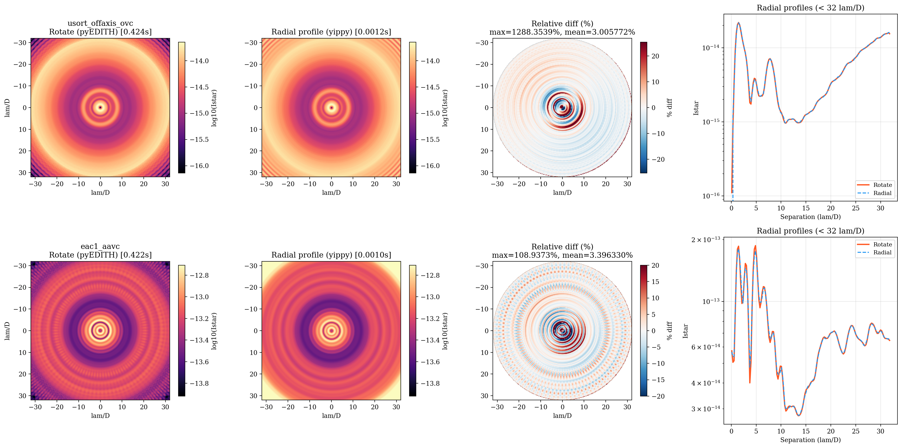

# Azimuthal Averaging of Stellar Intensity

## Background

The stellar intensity map from a YIP has real azimuthal structure, even for
radially symmetric (`1d`) coronagraphs. Airy rings and diffraction features
produce 70-90% azimuthal variation at moderate separations (e.g. r=10 pixels).

For yield calculations and integration time estimation, the azimuthally
**averaged** stellar intensity at a given separation is typically desired
rather than the raw position-angle-dependent value. This ensures that a
planet's background noise estimate depends only on its angular separation,
not its arbitrary position angle.

## Two Approaches

### Rotate-and-average (pyEDITH legacy)

Rotate the 2D stellar intensity image through many angles and average:

```python
from scipy.ndimage import rotate
import numpy as np

ntheta = 100
theta = np.linspace(0, 360, ntheta, endpoint=False)
result = np.zeros_like(istar_2d)
for angle in theta:
    result += rotate(istar_2d, angle, reshape=False, order=3)
result /= ntheta
```

This is conceptually simple but has several drawbacks:

- **Slow**: 100 cubic interpolation passes (~0.4s per coronagraph)
- **Rotation artifacts**: each `scipy.ndimage.rotate` call introduces
  cubic interpolation error that accumulates across rotations
- **Residual azimuthal structure**: the averaged result is not perfectly
  symmetric, so the value at (r, PA=45deg) differs from (r, PA=47deg)

### Radial profile projection (yippy)

Bin pixels by radius, compute the mean in each annular bin, fit a 1D
interpolator, and project back onto the pixel grid:

```python
from yippy import Coronagraph

coro = Coronagraph(yip_path, psf_trunc_ratio=0.3)

# Already available: coro.core_mean_intensity(separation)
# To get a 2D map:
r_lod = coro.separation_map()  # (npix, npix) separations in lam/D
istar_az_avg = coro.core_mean_intensity(r_lod)
```

This approach:

- **Fast**: a single vectorized interpolation call (~0.001s)
- **Artifact-free**: no rotation interpolation artifacts
- **True azimuthal mean**: mathematically exact average over all position
  angles, by definition
- **Perfectly symmetric**: every pixel at the same radius gets the exact
  same value

## Comparison

Tested on `usort_offaxis_ovc` and `eac1_aavc` coronagraphs (256x256,
pixscale=0.25 lam/D), comparing within 32 lam/D:

| Metric | usort | eac1 |
|---|---|---|
| Rotate time (100 angles) | 0.424s | 0.422s |
| Radial profile time | 0.001s | 0.001s |
| **Speedup** | **365x** | **424x** |
| Max relative difference | 1288% (1e-17 center) | 109% |
| Mean relative difference | 3.0% | 3.4% |

The large max relative differences occur at near-zero-signal pixels close
to the center where relative percentages blow up. The mean ~3% difference
is real and originates from rotation interpolation artifacts in the
rotate-and-average method.



**Left pair**: 2D maps (log scale) from each method appear visually
similar, with clear Airy ring structure. **Third column**: relative
difference map reveals systematic ring-pattern offsets at Airy ring
peaks/troughs. **Right**: radial profiles overlay, showing the radial
profile method (blue dashed) produces a smoother curve than the
rotate method (orange solid).

## Radial Binning Parameters

The radial profile uses `floor(max(image_shape) / 2)` bins (128 for a
256x256 image). Each bin spans ~1.4 pixels (~0.35 lam/D at pixscale=0.25),
giving ~3 bins per Airy ring spacing. This is adequate for capturing the
azimuthal average without tracking fine Airy ring oscillations, which is
desirable for the averaged quantity.

## Recommendation

Use yippy's `core_mean_intensity` (radial profile) instead of the
rotate-and-average approach. It is faster, more accurate, and produces
cleaner azimuthal averages.

For the noise floor, divide by the post-processing factor:

```python
noise_floor_ayo = coro.core_mean_intensity(separation) / ppf
```

See also: [Noise Floor Conventions](examples/06_Noise_Floor_Conventions.ipynb)
