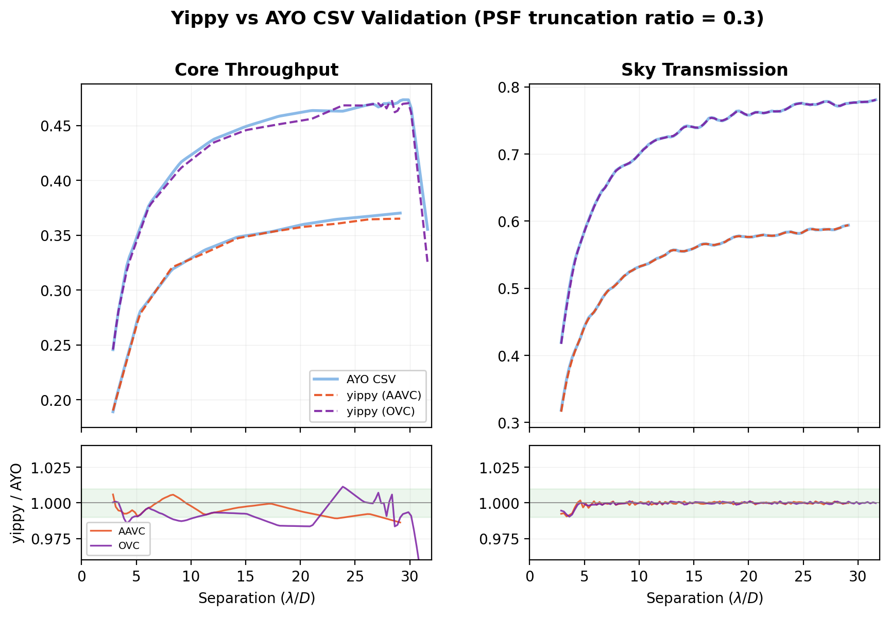

# Benchmarking: Yippy vs AYO

This page summarizes validation of yippy's coronagraph performance metrics
against AYO's IDL implementation, tested on two coronagraphs (AAVC and OVC)
with PSF truncation ratio 0.3.

## Key Results

| Metric | AAVC mean (max err) | OVC mean (max err) |
|---|---|---|
| Core throughput | 0.9948 (1.4%) | 0.9907 (8.6%) |
| Sky transmission | 0.9994 (0.9%) | 0.9995 (1.0%) |
| Raw contrast | 1.0000 (< 0.1%) | 1.0000 (< 0.1%) |
| Noise floor | 1.0000 (< 0.1%) | 1.0000 (< 0.1%) |

Raw contrast and noise floor match exactly because both AYO and yippy
clamp values at the contrast floor ($10^{-10}$), which dominates across
most of the science region. The figure below focuses on throughput and
sky transmission, the two metrics with meaningful variation.

